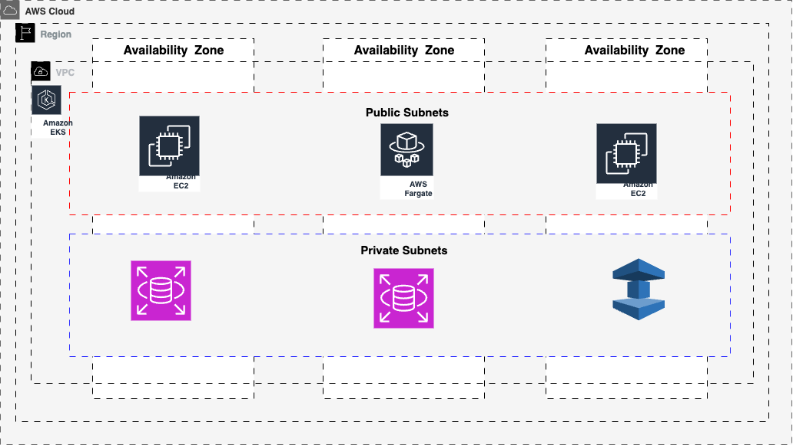

# 🚀 Production-Ready EKS Infrastructure with Terraform & GitHub Actions

[](https://aws.amazon.com/)
[](https://terraform.io/)
[](https://github.com/features/actions)
[](https://kubernetes.io/)

## 📋 Overview

This repository provides a **production-grade Infrastructure as Code (IaC)** solution for deploying a secure, scalable Amazon EKS (Elastic Kubernetes Service) cluster on AWS. Built with DevOps best practices, this project automates infrastructure provisioning using **Terraform**, **Terragrunt**, and **GitHub Actions**.

### 🎯 Project Purpose

This infrastructure repository supports the deployment of an **e-voting application** using GitOps methodology with ArgoCD. The project demonstrates:

- **Separation of Concerns**: Infrastructure (this repo) vs Application ([e-voting-application](https://github.com/isrealei/e-voting-applcation))
- **Production-Ready Architecture**: Secure, scalable, and maintainable infrastructure
- **DevOps Best Practices**: Automated CI/CD, infrastructure testing, and security scanning

> **🔗 Related Repository**: [E-Voting Application](https://github.com/isrealei/e-voting-applcation) - GitOps repository synced into the EKS cluster

## 🏗️ Architecture Overview



The infrastructure follows AWS Well-Architected Framework principles:

- **Security**: OIDC authentication, encrypted storage, network segmentation
- **Reliability**: Multi-AZ deployment, auto-scaling, health checks  
- **Performance**: Optimized instance types, load balancing, caching
- **Cost Optimization**: Spot instances, right-sizing, resource tagging
- **Operational Excellence**: Automated deployments, monitoring, logging

## 📁 Repository Structure

```
infrastructure-modules/
├── 📁 .github/workflows/     # GitHub Actions CI/CD pipelines
│   └── terraform.yaml        # Main infrastructure deployment workflow
├── 📁 architecture-diagrams/ # System architecture documentation
│   └── arch2.png            # Infrastructure architecture diagram
├── 📁 infra-live/           # Terragrunt-based multi-environment setup
│   ├── terragrunt.hcl       # Root Terragrunt configuration
│   ├── 📁 dev/              # Development environment
│   ├── 📁 staging/          # Staging environment  
│   ├── 📁 prod/             # Production environment
│   └── 📁 env/              # Environment-specific configurations
├── 📁 infra-live2/          # Alternative Terraform setup
│   ├── main.tf              # Main infrastructure definitions
│   ├── variables.tf         # Input variables
│   ├── kubernetes.tf        # Kubernetes resources & ArgoCD setup
│   └── 📁 vars/             # Environment-specific variable files
├── 📁 modules/              # Reusable Terraform modules
│   ├── 📁 vpc/              # VPC networking module
│   ├── 📁 eks/              # EKS cluster module
│   └── 📁 database/         # Database module (RDS/Aurora)
└── README.md                # This file
```

## 🧱 Infrastructure Modules

### 🌐 VPC Module (`modules/vpc/`)
**Purpose**: Creates a production-ready VPC optimized for EKS workloads

- ✅ **Multi-AZ Setup**: Public and private subnets across multiple availability zones
- ✅ **EKS Integration**: Proper subnet tagging for load balancer placement
- ✅ **Security**: Network ACLs, route tables, and security group foundations
- ✅ **Scalability**: CIDR blocks designed for future expansion

### ⚙️ EKS Module (`modules/eks/`)  
**Purpose**: Deploys a secure, production-grade EKS cluster

- ✅ **Managed Node Groups**: Auto-scaling worker nodes with optimized AMIs
- ✅ **Fargate Profiles**: Serverless container execution for specific workloads
- ✅ **Security**: IRSA (IAM Roles for Service Accounts), encryption at rest
- ✅ **Add-ons**: AWS Load Balancer Controller, Metrics Server, CoreDNS
- ✅ **Networking**: Private API endpoint with controlled public access

### 🗄️ Database Module (`modules/database/`)
**Purpose**: Managed database services for application data

- ✅ **Multi-Engine Support**: PostgreSQL, MySQL, Aurora compatibility
- ✅ **High Availability**: Multi-AZ deployments with automated failover
- ✅ **Security**: Encryption, VPC isolation, parameter groups
- ✅ **Backup & Recovery**: Automated backups with point-in-time recovery

## 🚀 Deployment Approaches

### 1️⃣ **Terragrunt Approach** (`infra-live/`) 
**🎯 Recommended for Production & Multi-Environment Setups**

```bash
# Deploy to development environment
cd infra-live/dev
terragrunt run-all apply

# Deploy to production environment  
cd infra-live/prod
terragrunt run-all apply
```

**Benefits:**
- ✅ **DRY Principle**: Eliminates code duplication across environments
- ✅ **State Management**: Automatic backend configuration and locking
- ✅ **Dependency Management**: Handles module dependencies automatically
- ✅ **Environment Isolation**: Complete separation between dev/staging/prod
- ✅ **Scalability**: Easy to add new environments and regions

### 2️⃣ **Direct Terraform Approach** (`infra-live2/`)
**🎯 Suitable for Single Environment or CI/CD Automation**

```bash
# Deploy using GitHub Actions (automatic)
# Push to main branch triggers deployment

# Or deploy manually
cd infra-live2
terraform init
terraform plan
terraform apply
```

**Benefits:**
- ✅ **Simplicity**: Direct Terraform without additional tools
- ✅ **CI/CD Integration**: Optimized for GitHub Actions workflows
- ✅ **Transparency**: Clear visibility of all resources in single state
- ✅ **Quick Setup**: Faster initial deployment for demos/testing

## 🔄 CI/CD Pipeline with GitHub Actions

### 🔐 Secure OIDC Authentication

This project implements **GitHub Actions OIDC** integration with AWS for secure, keyless authentication:

```yaml
# No stored AWS credentials needed!
permissions:
  id-token: write    # Generate OIDC tokens
  contents: read     # Read repository contents
```

**Security Benefits:**
- 🔒 **No Long-lived Credentials**: No AWS access keys stored in GitHub
- ⏰ **Short-lived Tokens**: Temporary credentials valid only during workflow execution
- 🎯 **Principle of Least Privilege**: Scoped permissions per workflow
- 📋 **Audit Trail**: Complete logging of all AWS API calls

### 🛠️ Workflow Features

- **🔍 Security Scanning**: Automated security analysis with tfsec
- **📋 Code Validation**: Terraform formatting and syntax checking
- **🌍 Multi-Environment**: Support for dev, staging, and production deployments
- **🎯 Manual Controls**: Workflow dispatch for controlled deployments
- **📊 Plan Reviews**: Terraform plan output in pull request comments

## ⚡ EKS Add-ons & Production Features

The EKS cluster comes pre-configured with essential production add-ons using [AWS EKS Blueprints](https://github.com/aws-ia/terraform-aws-eks-blueprints):

### 🔧 Core Add-ons
- **🌐 AWS Load Balancer Controller** - Ingress and service load balancing
- **📊 Metrics Server** - Resource usage metrics for HPA/VPA
- **🚀 Karpenter** - Intelligent node auto-scaling and provisioning
- **🌍 CoreDNS** - Cluster DNS resolution and service discovery
- **🔗 Kube-proxy** - Network proxy and load balancing

### 🛡️ Security & Observability  
- **🔒 External Secrets Operator** - Secure secret management from AWS
- **📋 Cert-Manager** - Automated TLS certificate management
- **📊 AWS for Fluent Bit** - Centralized logging to CloudWatch
- **🔍 Velero** - Backup and disaster recovery

### 📦 GitOps Integration
- **🔄 ArgoCD** - Automated application deployment and sync
- **🎯 ArgoCD Image Updater** - Automatic image updates from container registries
- **📁 Repository Integration** - Direct sync with [e-voting application](https://github.com/isrealei/e-voting-applcation)

## 🛠️ Quick Start Guide

### Prerequisites
- ✅ AWS CLI configured with appropriate permissions
- ✅ Terraform >= 1.0
- ✅ Terragrunt >= 0.35 (for `infra-live/` approach)
- ✅ kubectl for cluster interaction

### 🚀 Option 1: Terragrunt Deployment (Recommended)

```bash
# 1. Clone the repository
git clone https://github.com/isrealei/infrastructure-modules.git
cd infrastructure-modules

# 2. Configure AWS credentials (temporary)
export AWS_PROFILE=your-profile
# or
export AWS_ACCESS_KEY_ID=your_access_key
export AWS_SECRET_ACCESS_KEY=your_secret_key
export AWS_DEFAULT_REGION=us-west-2

# 3. Deploy VPC first
cd infra-live/dev/vpc
terragrunt init
terragrunt apply

# 4. Deploy EKS cluster
cd ../eks
terragrunt init  
terragrunt apply

# 5. Configure kubectl
aws eks update-kubeconfig --region us-west-2 --name dev-eks-cluster
```

### 🎯 Option 2: GitHub Actions Deployment (Production)

```bash
# 1. Fork this repository
# 2. Set up required GitHub secrets (see configuration section)
# 3. Push changes to main branch - automatic deployment triggers
# 4. Monitor workflow progress in Actions tab
```

## ⚙️ Configuration & Setup

### 🔑 Required GitHub Secrets

For GitHub Actions CI/CD pipeline, configure these repository secrets:

```bash
AWS_ACCOUNT_ID      # Your AWS account ID (e.g., 123456789012)
AWS_ROLE_NAME       # IAM role for GitHub Actions OIDC
AWS_DEFAULT_REGION  # Target AWS region (e.g., us-west-2)
BUCKET_TF_STATE     # S3 bucket for Terraform state storage
DYNAMO_DB_LOCK      # DynamoDB table for state locking
```

### 🏗️ AWS Infrastructure Prerequisites

#### 1. Create S3 Bucket for Terraform State
```bash
aws s3 mb s3://your-terraform-state-bucket-name
aws s3api put-bucket-versioning \
  --bucket your-terraform-state-bucket-name \
  --versioning-configuration Status=Enabled
```

#### 2. Create DynamoDB Table for State Locking
```bash
aws dynamodb create-table \
  --table-name terraform-state-lock \
  --attribute-definitions AttributeName=LockID,AttributeType=S \
  --key-schema AttributeName=LockID,KeyType=HASH \
  --provisioned-throughput ReadCapacityUnits=1,WriteCapacityUnits=1
```

#### 3. Set up OIDC Identity Provider
```bash
# This enables GitHub Actions to assume AWS roles securely
aws iam create-open-id-connect-provider \
  --url https://token.actions.githubusercontent.com \
  --client-id-list sts.amazonaws.com \
  --thumbprint-list 6938fd4d98bab03faadb97b34396831e3780aea1
```

### 📊 Environment Variables

Customize your deployment by modifying these key variables:

```hcl
# infra-live2/variables.tf
variable "cluster_name" {
  default = "production-eks"  # EKS cluster name
}

variable "node_instance_types" {
  default = ["t3.medium", "t3.large"]  # EC2 instance types
}

variable "desired_capacity" {
  default = 2  # Number of worker nodes
}
```

## 🔧 Post-Deployment Steps

### 1. Verify Cluster Access
```bash
kubectl get nodes
kubectl get pods --all-namespaces
```

### 2. Install ArgoCD CLI (Optional)
```bash
kubectl create namespace argocd
kubectl apply -n argocd -f https://raw.githubusercontent.com/argoproj/argo-cd/stable/manifests/install.yaml
```

### 3. Connect Application Repository
The cluster automatically syncs with your [e-voting application](https://github.com/isrealei/e-voting-applcation) repository through ArgoCD configuration.

## 🏆 Why Choose This Infrastructure?

### ✨ **Production-Ready Features**
- 🔒 **Security-First**: OIDC authentication, encrypted storage, network isolation
- 📈 **Auto-Scaling**: Karpenter for intelligent node management
- 🔄 **GitOps-Ready**: Pre-configured ArgoCD for application deployments  
- 🌍 **Multi-Environment**: Support for dev, staging, and production
- 📊 **Observability**: Built-in logging, monitoring, and alerting

### 🛠️ **DevOps Best Practices**
- 📦 **Modular Design**: Reusable Terraform modules for any project
- 🔄 **DRY Principle**: No code duplication across environments  
- 🚀 **CI/CD Integration**: Automated testing and deployment pipelines
- 📋 **Documentation**: Comprehensive guides and inline comments
- 🔍 **Code Quality**: Automated formatting, validation, and security scanning

### 🎯 **Real-World Applications**  
- 🗳️ **E-Voting Platform**: Secure, scalable voting applications
- 🛒 **E-Commerce**: High-traffic online retail platforms
- 💰 **FinTech**: Financial services with strict compliance requirements
- 🏥 **Healthcare**: HIPAA-compliant medical applications
- 📚 **EdTech**: Educational platforms with variable workloads

## 🤝 Contributing

We welcome contributions! Please see our [contributing guidelines](CONTRIBUTING.md) for details on:
- 🐛 Reporting bugs and issues
- 💡 Suggesting new features
- 🔧 Submitting pull requests
- 📋 Code review process

## 📞 Support & Community

- 📧 **Issues**: [GitHub Issues](https://github.com/isrealei/infrastructure-modules/issues)
- 💬 **Discussions**: [GitHub Discussions](https://github.com/isrealei/infrastructure-modules/discussions)
- 📖 **Documentation**: [Wiki](https://github.com/isrealei/infrastructure-modules/wiki)

## 📄 License

This project is licensed under the MIT License - see the [LICENSE](LICENSE) file for details.

---

<div align="center">

**🌟 If this project helped you, please give it a star! ⭐**

*Built with ❤️ for the DevOps community*

</div>
